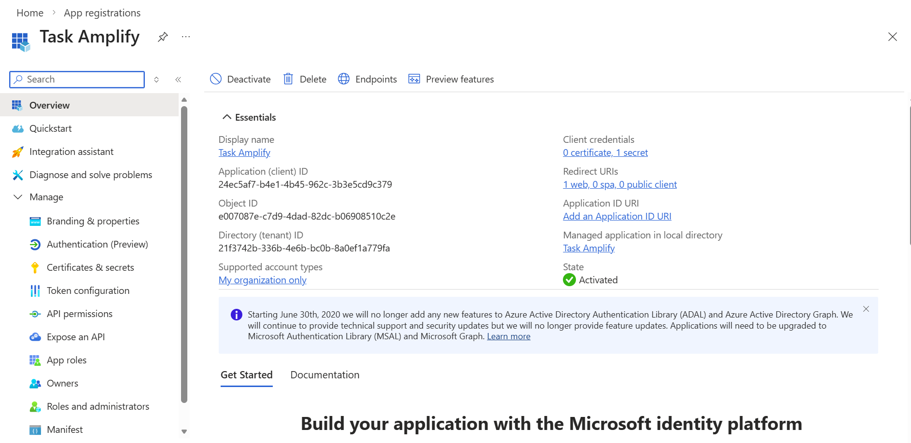
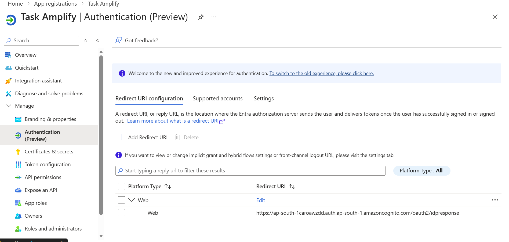
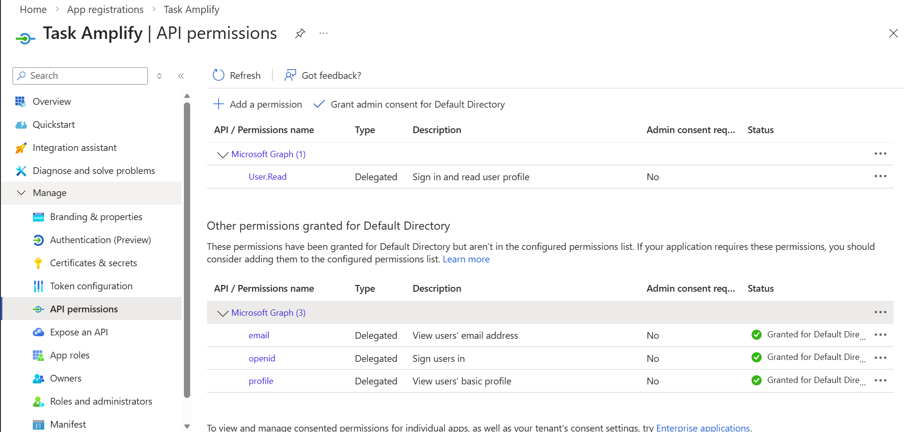
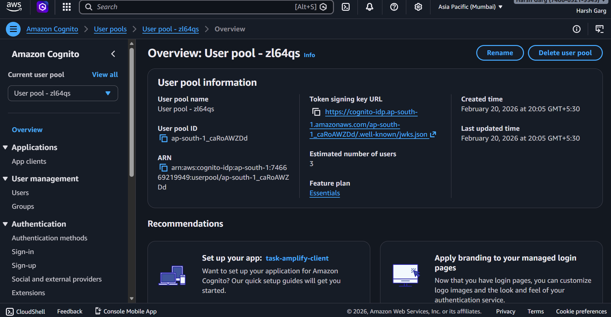
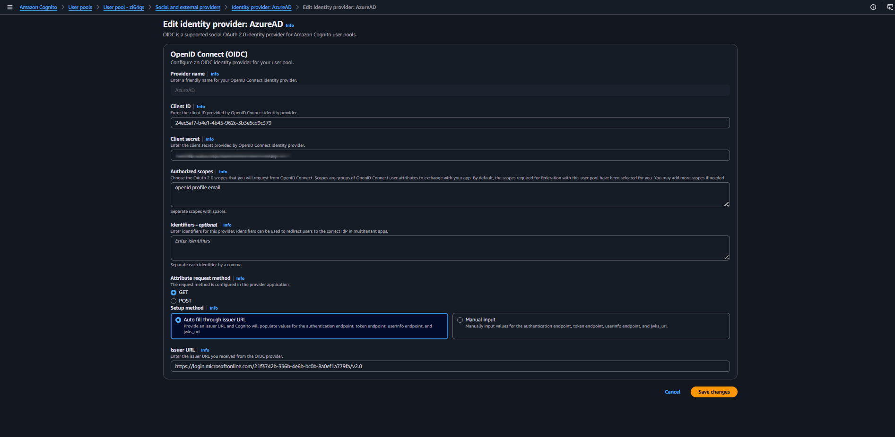
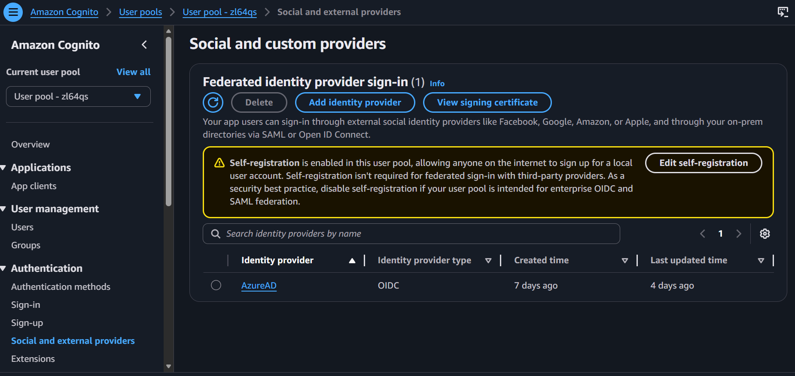
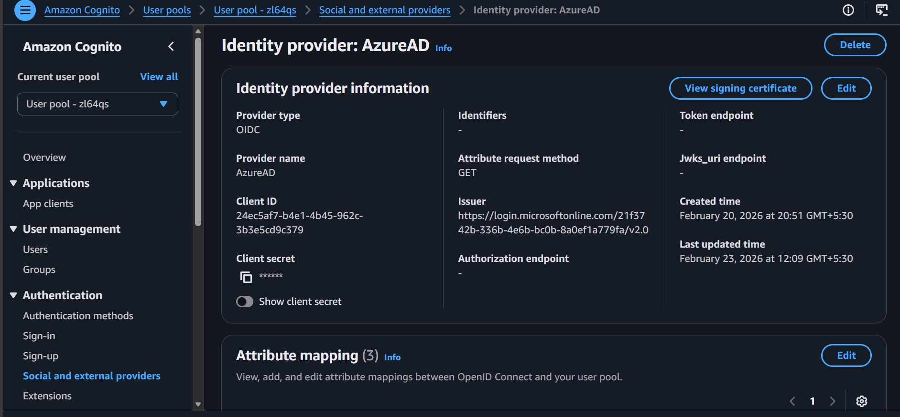
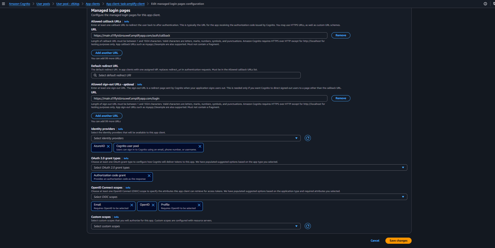

# SSO Implementation Guide: Azure AD (Microsoft Entra ID) + AWS Cognito + Next.js

## 1. Purpose

This document explains the complete Single Sign-On (SSO) implementation used in this project:

- Identity Provider (IdP): Microsoft Entra ID (Azure AD)
- Federation Broker: AWS Cognito Hosted UI
- Application: Next.js frontend
- OAuth Flow: Authorization Code + PKCE

---

## 2. Final Architecture

1. User clicks **Sign in with Microsoft** in the app.
2. App redirects to **AWS Cognito Hosted UI** `/oauth2/authorize`.
3. Cognito forwards authentication to **Azure AD** (configured IdP name: `AzureAD`).
4. Azure AD redirects back to Cognito at:
   - `https://<cognito-domain>.auth.<region>.amazoncognito.com/oauth2/idpresponse`
5. Cognito completes federation and redirects to app callback URL:
   - `<app-callback-url>` (example: `https://<app-domain>/api/auth/callback`)
6. App exchanges auth code at Cognito `/oauth2/token` and stores tokens.

---

## 3. Prerequisites

- AWS account with Cognito permissions
- Azure/Entra tenant with App Registration permissions
- Cognito User Pool domain configured
- Next.js app environment variables configured

---

## 4. Azure AD Setup

## 4.1 Create App Registration

In Azure portal:

1. Go to **Microsoft Entra ID** → **App registrations** → **New registration**.
2. Name: `Philips-Sensei` (or tenant naming standard).
3. Supported account type: choose per org policy (typically single-tenant).
4. Create the application.




## 4.2 Configure Redirect URI (Critical)

Add **Web** redirect URI:

- `https://<cognito-domain>.auth.<region>.amazoncognito.com/oauth2/idpresponse`

Why this matters:
- This URI is for **Azure → Cognito** federation callback.
- Do **not** use the app callback (`/api/auth/callback`) here.



## 4.3 Generate Client Secret (for OIDC)

1. Go to **Certificates & secrets**.
2. Create a new client secret.
3. Copy and securely store the secret value.

Used where:
- Cognito OIDC IdP configuration requires Azure Client ID + Client Secret.


## 4.4 API Permissions

Ensure delegated OpenID permissions are granted:

- `openid`
- `profile`
- `email`


---


## 5. AWS Cognito Setup

## 5.1 User Pool + Domain

1. Create/use existing User Pool.
2. Configure Hosted UI domain.
3. Domain used in this project pattern:
   - `https://<cognito-domain>.auth.<region>.amazoncognito.com`



## 5.2 Add Azure AD as Identity Provider

In User Pool federation settings:

1. Add external IdP (OIDC).
2. Provider name: `AzureAD`.
3. Setup method: **Auto fill through issuer URL**.
4. Enter Azure OIDC Issuer URL in this format:
   - `https://login.microsoftonline.com/<tenant-id>/v2.0`
5. Cognito auto-populates OIDC endpoints (`authorize`, `token`, `userInfo`, `jwks_uri`) from Azure discovery metadata.
6. Enter Azure Client ID and Client Secret.
7. Enter openid profile email as your Authorized Scopes.
8. Save provider.



How to get `<tenant-id>`:
- Azure Portal → App Registrations → Your App → Overview → Tenant ID

Important clarification:
- The Issuer URL is **not generated by Cognito**.
- You provide the tenant-specific issuer URL from Azure.
- Cognito only auto-fills endpoint fields after you provide the Issuer URL.

Notes:
- If configured as SAML instead, secret is not used.
- This implementation assumes OIDC because the app uses OIDC scopes and `identity_provider=AzureAD`.




## 5.3 Configure App Client

In Cognito App Client settings:

1. Enable **Authorization code grant**.
2. Callback URL:
   - `<app-callback-url>` (example: `https://<app-domain>/api/auth/callback`)
3. Sign-out URL:
   - `<app-logout-url>` (example: `https://<app-domain>/login`)
4. Allowed scopes:
   - `openid`
   - `profile`
   - `email`
5. Enable Identity providers: `AzureAD` (and Cognito native if needed by policy).



---

## 6. Application Configuration

In `.env.local` (frontend):

```env
NEXT_PUBLIC_COGNITO_REGION=<aws-region>
NEXT_PUBLIC_COGNITO_USER_POOL_ID=<user-pool-id>
NEXT_PUBLIC_COGNITO_CLIENT_ID=<app-client-id>
NEXT_PUBLIC_COGNITO_DOMAIN=<cognito-domain-prefix>
NEXT_PUBLIC_COGNITO_REDIRECT_URI=<app-callback-url>
NEXT_PUBLIC_COGNITO_LOGOUT_URI=<app-logout-url>
NEXT_PUBLIC_COGNITO_SCOPES=openid profile email
NEXT_PUBLIC_IDENTITY_PROVIDER=AzureAD
```

Behavior implemented:

- Login button triggers Hosted UI URL generation.
- URL includes:
  - `response_type=code`
  - `identity_provider=AzureAD`
  - `code_challenge_method=S256` (PKCE)
- Callback page exchanges code at Cognito `/oauth2/token`.
- Tokens are stored in browser storage for session continuity.

---

## 7. End-to-End Validation Steps

1. Open app login page.
2. Click **Sign in with Microsoft**.
3. Confirm browser goes to Cognito Hosted UI authorize endpoint.
4. Confirm redirect to Microsoft login.
5. Sign in with test account.
6. Confirm redirect path sequence:
   - Azure → `/oauth2/idpresponse` (Cognito)
   - Cognito → `/api/auth/callback` (app)
7. Confirm app lands on `/home` with authenticated session.

Evidence to capture:
- Browser address bar at each redirect stage
- Cognito Hosted UI network calls
- Successful `/oauth2/token` response

---
